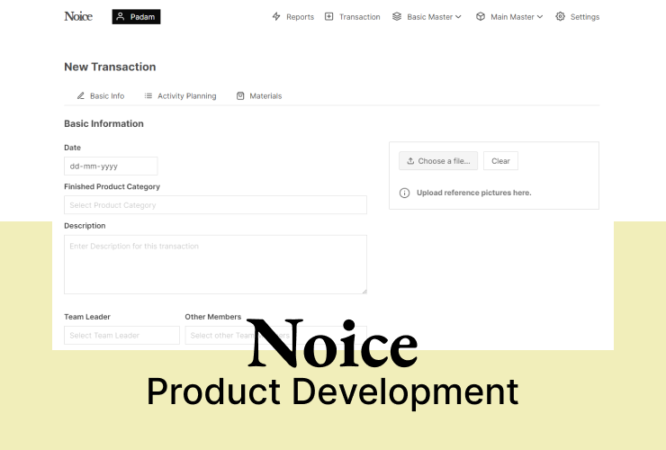

     
 

Noice helps businesses to get sampling off the ground fast AF with activity tracking.
 
<i> Built with Indian businesses , for Indian businesses </i>

Built for businesses in the manufacturing segment , where each product name is built up of multiple variables . 
Allows to create custom product names - currently configured for textile & fashion businesses .

## Features

 * Add and create custom products from upto 5 variables.
 * Master - Slave model for data.
 * Activity tracking for each sample - with TODO lists .
 * Image uploads for reference for creating samples

## Setup & Running

*NOTE:* You'll need to use python3. 

To install requirements :

> pip install -r requirements.txt

Noice uses MySQL as a backend , but you are free to use any. Just change the the Database URI in config.py

> python ./run.py
## Issues and Requests
For any issue or requests , please use Github Issues.

## Projects Used
* Bulma
* Vue.js
* SQLAlchemy
* Buefy
* Flask
* Albemic

## License
This project is licensed under the [MIT License](./LICENSE).